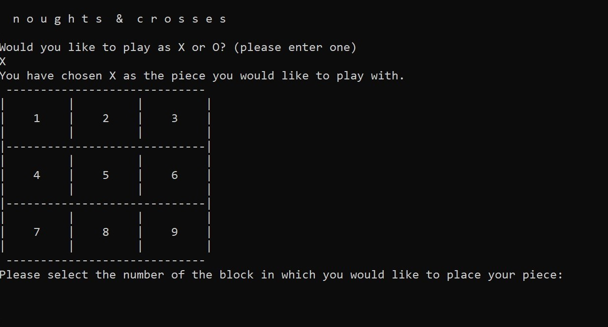

# noughts-and-crosses
This is a simple command-line game. At the moment, it only plays random moves from the computer's side. 
In the future I'm hoping to hook it up to some machine learning to get it to play properly. 

